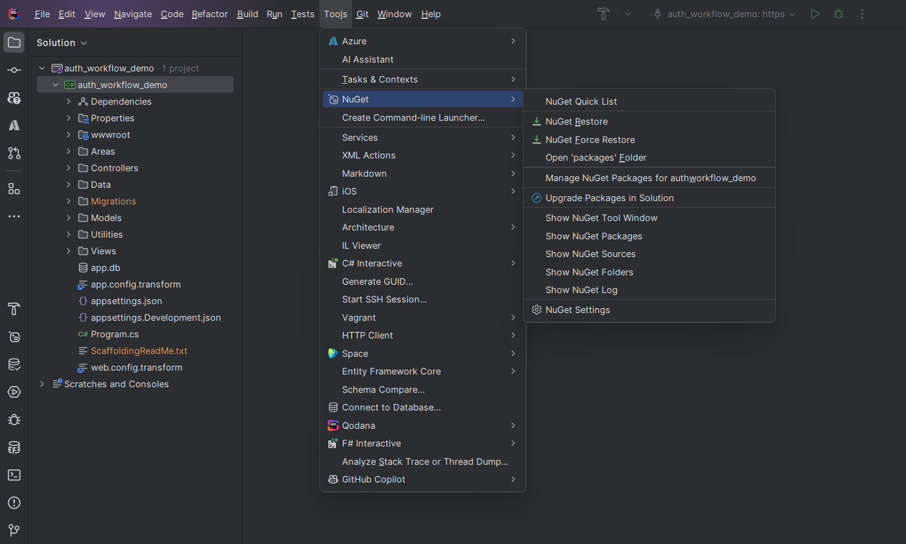
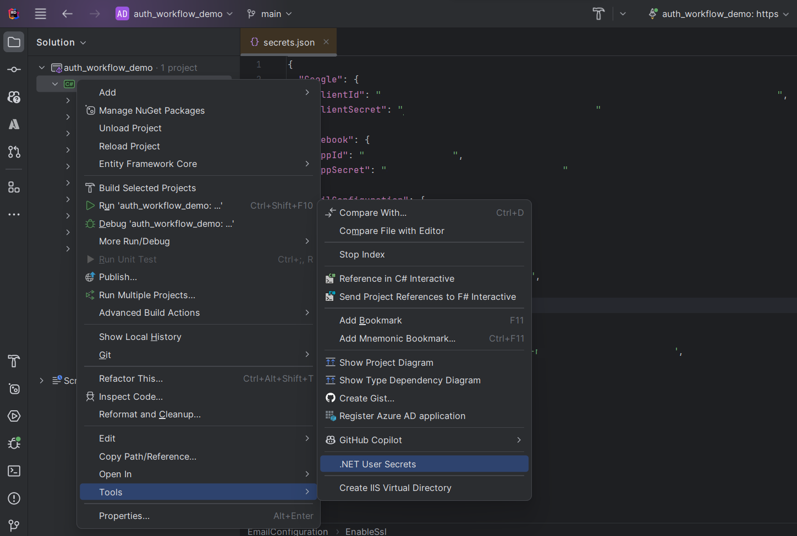
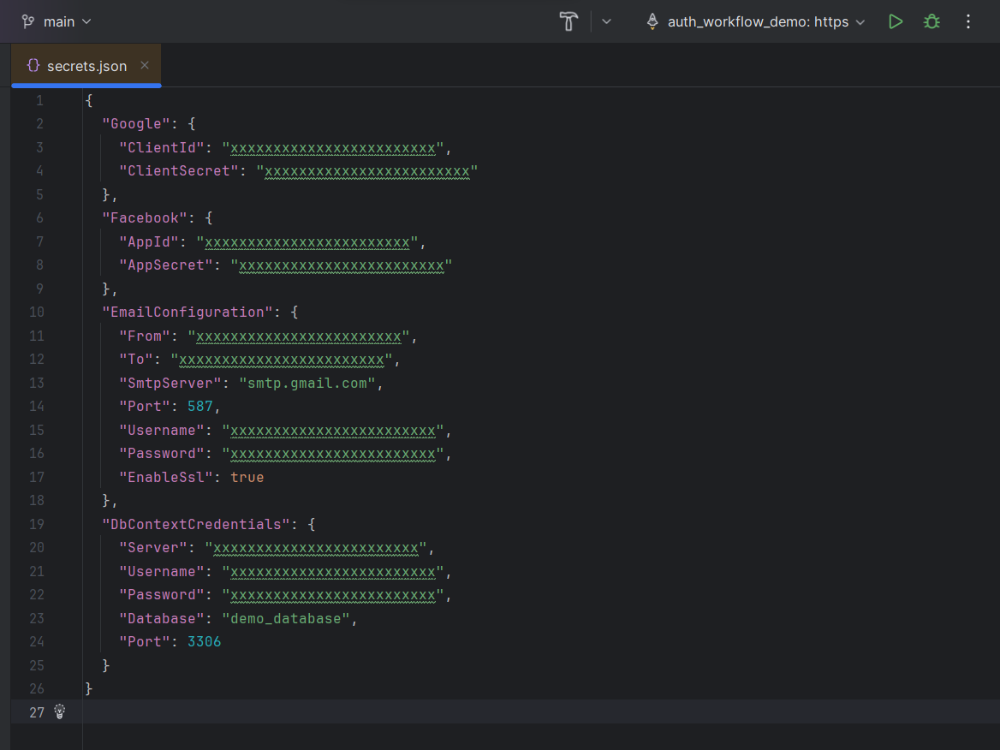
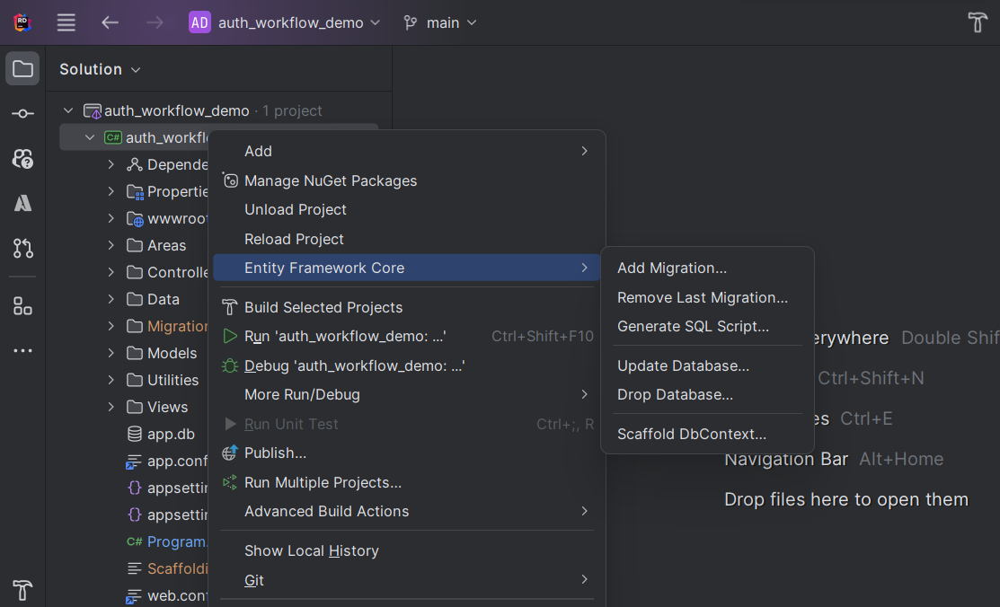
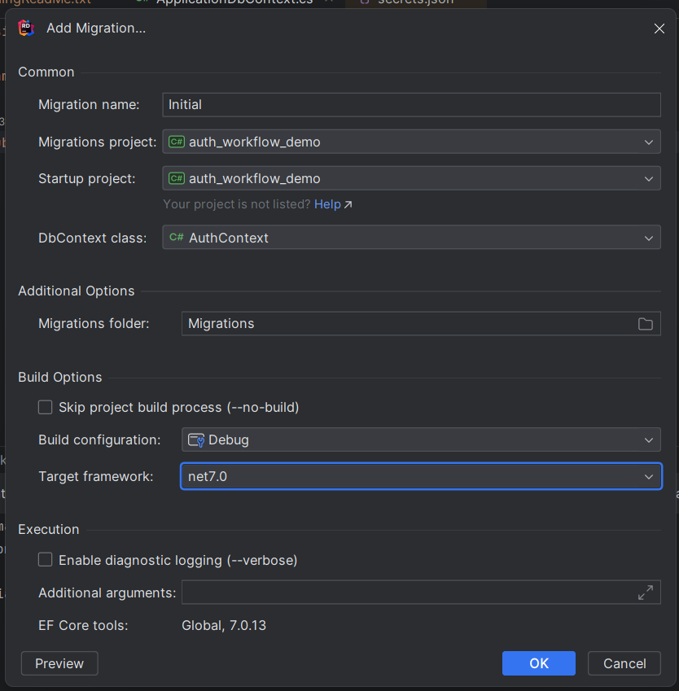
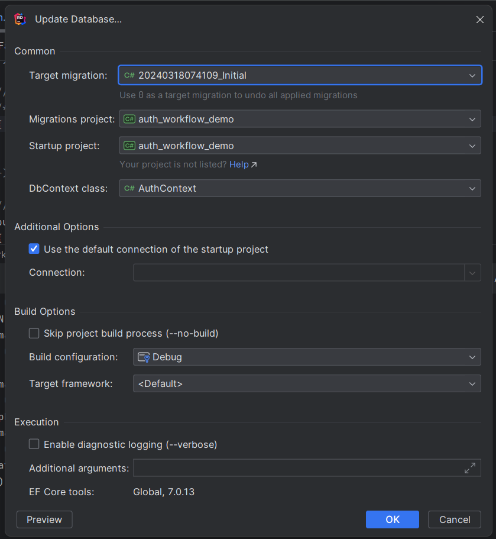

# ZAMREN Management System

Welcome to the ZAMREN Management System repository! This project is a fully Identity Scaffolded app that includes a comprehensive user registration module, a functional workflow module for transactional task allocation and status tracking, and role-based user access. Additionally, the app features a test email service configured with SMTP and utilizes .NET user secrets for sensitive data.

## Dependencies

Ensure that you have the required dependencies installed:

- ASP.NET 7 SDK
- MySQL v8.0

## Features

### User Registration Module

The app incorporates the following user registration modules provided by ASP Identity Scaffolding:

1. **User Registration**: Standard user registration functionality allows users to sign up by providing essential information such as username, email, and password.

2. **Two-Factor Authentication (2FA)**: Enhance security by enabling two-factor authentication, requiring users to verify their identity through an additional step, typically involving either one of the following:
- An OTP code sent to their mobile device via SMS or email.
- A code generated by an authenticator app such as Google Authenticator or Microsoft Authenticator.
- Recovery codes for account access in case of lost or compromised devices.

3. **Email Confirmation**: Improve user verification with email confirmation, ensuring that the registered email address is valid and owned by the user.

4. **Password Recovery**: Allow users to recover their account by providing a mechanism for password reset, typically involving a secure email-based recovery process.

6. **Role-Based Authorization**: Implement role-based access control (RBAC) to categorize users into predefined roles, such as Admin, Manager, and User, and control access to specific features based on these roles.

7. **Privilege-Based Authorization**: Leverage role-privilege authorization to grant or deny access to specific resources in the system based on the user's role and the privileges assigned to that role.

8. **User Lockout**: Enhance security by implementing user lockout mechanisms after a specified number of failed login attempts, preventing unauthorized access.

9. **Account Confirmation and Lockout Emails**: Keep users informed with automatic emails for account confirmation and lockout scenarios, providing a seamless user experience.

10. **Customizable User Profile**: Allow users to customize their profiles with additional information beyond the basic registration details.

12. **Account Deactivation and Deletion**: Implement features for deactivating or deleting user accounts, considering scenarios where users might want to temporarily disable their accounts or permanently remove them.

13. **User Activity Logs**: Track user activity logs to monitor user interactions with the system, including login attempts, password changes, and other relevant events.
14. **Workflow Module**: Implement a workflow module for transactional task allocation and status tracking, enabling users to create, assign, and track tasks through various stages of completion.
15. **Email Service Configuration**: Configure an email service with SMTP settings to enable email notifications for user registration, password recovery, and other system events.

## Getting Started

Follow these steps to get the application up and running locally:

1. Clone the repository to your local machine:

   ```bash
   git clone https://github.com/systemszamren/zamren-management-system.git
   ```
2. If you're having trouble cloning the repository and you're getting a `permission denied` error, you can try setting up an SSH key. You can follow the instructions in this [tutorial video](https://youtu.be/ePCBuIQJAUc?si=Ly6h1uq83T64h5G7).

2. Open the project in your favorite IDE: **JetBrains Rider** : )

3. Install all NuGet packages by Navigating to the **Tools** menu then goto **NuGet** then click **NuGet Restore**. See image below:


4. Configure .NET user secrets for sensitive data. Dot Net User Secrets provide a way to store sensitive data in a `secrets.json` file during the development process as opposed to storing sensitive data in the `appsettings.json` file. In JetBrains Rider, you can manage these secrets as follows:

   - Open the **Solution** window from the left sidebar.
   - Right-click on your project name, i.e: **zamren_management_system**.
   - Navigate to **Tools** and then click on **.NET User Secrets**.
   - This will open the `secrets.json` file where you can add and manage your sensitive data such as, Database connection string values and Email SMTP configurations values.
     
   - On a Windows machine, you can find this `secrets.json` file at the following path: `C:\Users\{Your_Windows_Username}\AppData\Roaming\Microsoft\UserSecrets\<UserSecretsId-located-in-zamren_management_system.csproj file>\secrets.json`
   - Sample `secrets.json` file below:
     

5. To run a database migration using JetBrains Rider IDE UI, you can follow these instructions:

   - Remember to use **MySQL v8.0** for this project.
   - Firstly connect to the MySQL database server in Rider IDE, see image below;
     
   - After successful connection, follow the instructions below to initiate your first database migration.
   - Open the **Solution** window from the left sidebar.
   - Right-click on your project name, i.e: **zamren_management_system**.
   - Navigate to **Entity Framework Core**.
   - Click on **Add Migration**. See image below;
     
   - Enter the following details in the 'Add Migration' window and click **OK** to initiate the migration.
     
   - To update the database with new changes, go to the **Solution** sidebar window, right click on the project name **zamren_management_system** then navigate to **Entity Framework Core**' then click on **Update Database**.
   - See image below for more info:
     

6. If you face any issues with regards to the 'dotnet ef' command, you can run the following command in the terminal to install the Entity Framework Core tools globally:
   ```bash
   dotnet tool install --global dotnet-ef --version 7.0.13
   ```
   
7. After which your database will have been created successfully. Check your DBMS to confirm.

6. You're all set. Build and run the application.


## Reference

For more information on ASP.NET Core 7 Scaffolding, you can check out this [Youtube tutorial](https://youtu.be/wzaoQiS_9dI?si=lUfB1E71kM1BxfKw).

## Contributing

We welcome contributions! If you find any issues or have ideas for improvements, please open an issue or submit a pull request.

## License

This project is licensed under the [MIT License](LICENSE.md) - see the [LICENSE.md](LICENSE.md) file for details.

Feel free to reach out if you have any questions or need further assistance. Happy coding!
